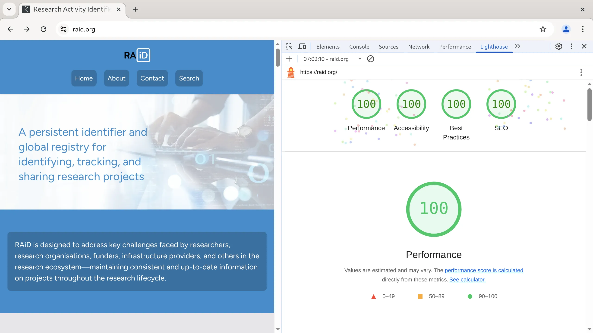

# raid.org - Astro static app for the Research Activity Identifier

## 🚀 Project Structure

Inside of this Astro project, you'll see the following folders and files:

```text
/
├── public/
├── src/
│   ├── components/
│   │   ├── 01-index-page/
│   │   ├── 02-about-page/
│   │   ├── 03-what-is-raid/
│   │   ├── 04-news-events-page/
│   │   │   ├── 01-news-events-intro.astro
│   │   │   ├── 02-news-grid.astro
│   │   │   ├── 03-events-list.astro
│   │   │   └── HOW-TO-CREATE-A-POST.md
│   │   └── layout-components/
│   ├── content/
│   │   ├── config.ts                  ← Zod schema for all collections
│   │   └── news-events/
│   │       ├── news/
│   │       │   └── YYYY-MM-post-name/ ← one folder per post
│   │       │       ├── index.md
│   │       │       └── hero.webp      ← images co-located with post
│   │       └── events/
│   │           └── YYYY-MM-event-name/
│   │               ├── index.md
│   │               └── hero.webp
│   ├── images/
│   │   ├── backgrounds/
│   │   ├── icons/
│   │   └── logos/
│   ├── layouts/
│   │   └── main.astro
│   └── pages/
│       ├── 404.html
│       ├── about.astro
│       ├── contact.astro
│       ├── index.astro
│       ├── news-events.astro          ← News & Events listing page
│       ├── news-events/
│       │   └── [...slug].astro        ← individual post pages
│       └── what-is-raid.astro
└── package.json
```

Astro looks for `.astro` or `.md` files in the `src/pages/` directory. Each page is exposed as a route based on its file name.

Components are organized by page in numbered directories under `src/components/`.

Static assets like images are placed in the `src/images/` directory.

## 🔎 RAiD Search

- [https://raid.org/search](https://raid.org/search)

The search functionality uses the DataCite API to find RAiD records. The implementation is in `src/scripts/search.ts`, which gets compiled to JavaScript during the build process via a postbuild script. The search allows users to query RAiDs by title, description, creator, related identifiers, and organization. Results can be downloaded as JSON files directly from the search interface.

## 🔀 RAiD Resolver

- [https://raid.org/{prefix}/{suffix}](https://raid.org/{prefix}/{suffix})
- Example:
  - [https://raid.org/102.100.100/601891](https://raid.org/102.100.100/601891) ➡️ [https://static.prod.raid.org.au/raids/102.100.100/601891/](https://static.prod.raid.org.au/raids/102.100.100/601891)

The resolver functionality is implemented through the 404 page. When a user accesses a URL with a RAiD pattern (e.g., `raid.org/102.100.100/601891`), the 404.html page captures the route, extracts the RAiD handle, validates it against an API, and redirects to the appropriate environment. This approach allows for dynamic resolution without requiring server-side processing.

## 📰 News & Events

The News & Events section is powered by Astro Content Collections with Zod schema validation.

- **Listing page**: `/news-events` — shows a paginated news grid and upcoming/past events list
- **Individual post pages**: `/news-events/[slug]` — full Markdown content with image support

Posts are Markdown files validated against a strict schema. Invalid frontmatter (missing fields, wrong types, summaries over 200 characters) fails the build with a clear error message. The VS Code Astro extension surfaces these errors inline as you type.

**To create a post**, follow the guide in [`src/components/04-news-events-page/HOW-TO-CREATE-A-POST.md`](src/components/04-news-events-page/HOW-TO-CREATE-A-POST.md).

Key features:
- `type: "news"` or `type: "event"` — each type enforces its own required fields
- `draft: true` — hides a post in production; visible in dev with a yellow badge
- `heroImage` — processed through Astro's image pipeline (responsive sizes, lazy loading, zero CLS)
- Events have `eventDate` (when the event occurs) separate from `date` (publication date)
- Events are automatically split into Upcoming and Past based on `eventDate`

---

## 📝 Editing Content

To edit content on the site:

1. Navigate to the page you want to modify in `src/pages/`
2. For each page, the content is split into modular components in the corresponding numbered directory under `src/components/`
3. Edit the `.astro` component files to update text, images, and layout
4. Components are numbered to indicate their order on the page
5. Layout components like the navbar and footer are in `src/components/layout-components/`

## 🎨 Styling with Tailwind CSS

This site uses Tailwind CSS for styling:

- All styling is done using Tailwind's utility classes directly in the HTML/Astro templates
- The Tailwind configuration is in `tailwind.config.mjs` where you can customize colors, fonts, and other design tokens
- No separate CSS files are needed for most styling tasks
- For responsive design, use Tailwind's built-in breakpoint prefixes: `sm:`, `md:`, `lg:`, `xl:`, etc.

To learn more about Tailwind:

- [Tailwind CSS Documentation](https://tailwindcss.com/docs)
- [Tailwind CSS Cheat Sheet](https://tailwindcomponents.com/cheatsheet/)
- [Tailwind + Astro Integration Guide](https://docs.astro.build/en/guides/integrations-guide/tailwind/)

## 🧞 Commands

All commands are run from the root of the project, from a terminal:

| Command                   | Action                                           |
| :------------------------ | :----------------------------------------------- |
| `npm install`             | Installs dependencies                            |
| `npm run dev`             | Starts local dev server at `localhost:4321`      |
| `npm run build`           | Build your production site to `./dist/`          |
| `npm run preview`         | Preview your build locally, before deploying     |
| `npm run astro ...`       | Run CLI commands like `astro add`, `astro check` |
| `npm run astro -- --help` | Get help using the Astro CLI                     |

## 🔨 Build Process

The build process consists of two main steps:

1. Astro's standard build (`astro build`): Generates the static site in the `./dist/` directory, including the 404.html page that powers the RAiD resolver.

2. TypeScript Compilation: A postbuild script compiles `src/scripts/search.ts` to JavaScript and places it in `public/scripts/`. This is necessary for the RAiD search functionality.

The build configuration in `astro.config.mjs` specifies `output: "static"` and `format: "file"` to ensure proper generation of all static assets including the 404.html page that handles RAiD resolution.

## 🚀 Deployment

The site is automatically deployed to GitHub Pages using a GitHub Actions workflow defined in `.github/workflows/astro.yml`. This CI/CD pipeline runs whenever changes are pushed to the main branch.

The deployment workflow:

1. Detects the package manager (npm or yarn)
2. Sets up Node.js environment (v20)
3. Configures GitHub Pages
4. Installs dependencies
5. Builds the site with environment variables from GitHub repository variables
6. Uploads the build artifact (dist directory)
7. Deploys to GitHub Pages

Environment variables used during deployment:
- `BASE_SLUG`: Base URL path for the site
- `BASE_SITE`: Base URL for the site
- `RAID_SEARCH_PAGE`: Configuration for the search page

The site is configured with the custom domain `raid.org` using a CNAME file in the repository.

## Astro documentation

Feel free to check [our documentation](https://docs.astro.build) or jump into our [Discord server](https://astro.build/chat).

## 🎛️ Lighthouse Score

Perfect lighthouse score


