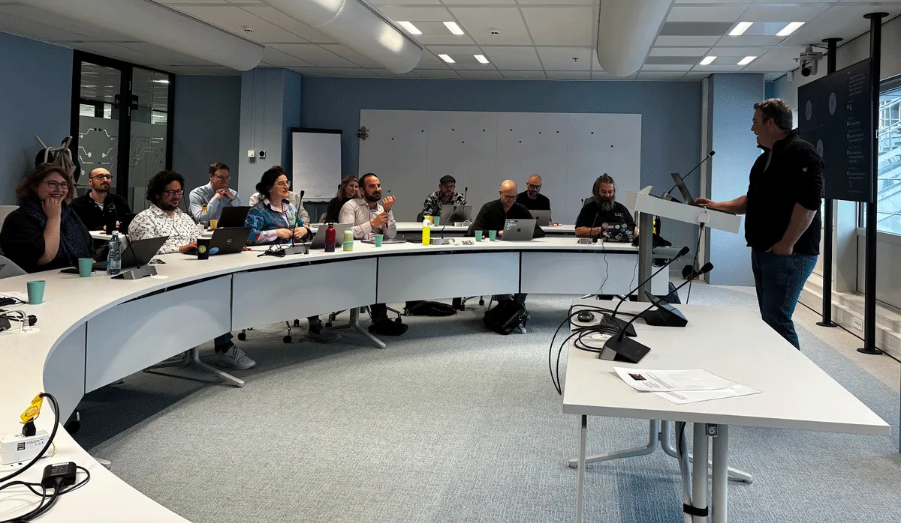

The Australian Research Data Commons (ARDC) is leading a new global partnership to strengthen the tracking of research projects worldwide. The Global RAiD Operating Alliance has been formally established with major research infrastructure organisations from the Netherlands, Canada, and the United States, cementing the future of the Research Activity Identifier (RAiD) as the global ISO standard for research projects.

The Alliance was publicly announced at the RAiD Global Community Meeting on 20 May following its establishment at the RAiD international partners meeting in Utrecht, the Netherlands, held between 14 and 16 April. This move signals to the international community that RAiD is ready to scale up significantly to meet the growing demand for comprehensive project identifiers.

*The RAiD international partners meeting in Utrecht, the Netherlands in April 2026*

RAiDs are persistent identifiers (PIDs) for research projects governed by the ISO 23527:2022 international standard and ARDC operates as the ISO-appointed Registration Authority for the RAiD service globally. RAiD works by bringing existing PIDs for the various elements of a research project – such as ORCIDs for researchers, DOIs for grants, data and publications, and RORs for institutions – into a single container. This container is given a globally unique, persistent and resolvable identifier called a RAiD, which allows the research project to be unambiguously identified, tracked and shared as a whole. RAiDs promote research integrity, efficiency and transparency by making information about research projects visible and portable.

## A new global alliance for research project information

The primary purpose of forming the Alliance is to accelerate RAiD's global adoption. This is achieved by encouraging operational collaboration, shared learning and aligning the strategies of all organisations running RAiD services.

The founding partners of the Global RAiD Operating Alliance include the ARDC and 3 key international organisations currently operating or actively working towards operating as RAiD Registration Agencies:

- SURF (The Netherlands)
- The Digital Research Alliance of Canada (DRAC)
- San Diego Supercomputer Center (SDSC) (United States)

Through partnerships like this one, global infrastructures are working together to meet the demand for robust project identifiers.

Natasha Simons, ARDC's Director, National Coordination, said: "I'm excited to be working with SURF, SDSC and DRAC in an alliance that will support the strategic direction and operational coordination of the emerging global federation of RAiD service operators. Projects are the beating heart of research endeavours – whether funded or unfunded – and the end beneficiaries of the RAiD federation will be researchers, funding agencies and institutions seeking greater visibility of research projects and their impact."

## Fostering coordination for global RAiD adoption

The new RAiD Operating Alliance will support the operational coordination needed for this emerging global federation of RAiD service operators. It also provides the critical groundwork for a long-term governance model.

The Alliance's core remit is structured around 4 main areas of collaboration:

1. Addressing operational challenges in running RAiD as a global federation
2. Designing future governance of RAiD in the long-term
3. Offering strategic and operational feedback to the ARDC as the RAiD Registration Authority
4. Forming subgroups to progress the operational and strategic direction of RAiD.

Find out how [persistent identifiers (PIDs) like RAiD can benefit your research projects and organisation](https://ardc.edu.au/services/ardc-identifier-services/).

---

This article was [originally published by the Australian Research Data Commons](https://ardc.edu.au/article/australian-led-raid-alliance-scales-up-global-project-tracking/). The ARDC is enabled by the National Collaborative Research Infrastructure Strategy (NCRIS) to support national digital research infrastructure for Australian researchers.
